# What Do You Mean?
Using Natural Language Processing (NLP) to analyze Federal Reserve (Fed) Speeches

## Problem
The Federal Reserve (the "Fed") is the central bank of the United States solely responsibly for enacting monetary policy as well as bank regulation. When commenting on the economy, the Fed tends to communicate in "Fedspeak," a term given to the “turgid dialect of English” used by the Federal Reserve Board chairmen. That is, the Fed is known to make wordy, vague and ambiguous statements when commenting on the current state of the economy. 

While Fedspeak is intentional to reduce market instability, financiers are forced to qualitatively comb over the Fed's word choice. Instead of trying to make sense of Fedspeak *qualitatively*, can we use Natural Language Processing (NLP) and Machine Learning (ML) to:
- Categorize the Fed's speeches into categories or topics of interest
- Identify trends in topics that the Fed is interested in
- Identify changes in the Fed's focus over time and across different economic cycles
- Recommend speeches that are similar to a speech of interest

## Dataset
Speeches were scrapped from the [Federal Reserve Website](https://www.federalreserve.gov/newsevents/speeches.htm)
- **Total Number of Speeches:** 1,432
- **Range of Years:** 1996 - 2019 (approx. 60 speeches per year)
- **Size of speech:** Approx. 1800 words

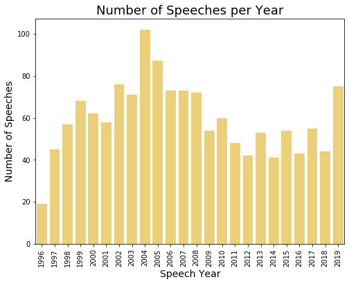

## Data Cleaning
Data Cleaning Process:
- Removed punctuation
- Removed all numbers
- Removed references (where necessary)
- Standardized case (all lower case)
- Removed stop words
- Tokenized words (using nltk)
- Lemmatized words (using nltk + POS tagging)

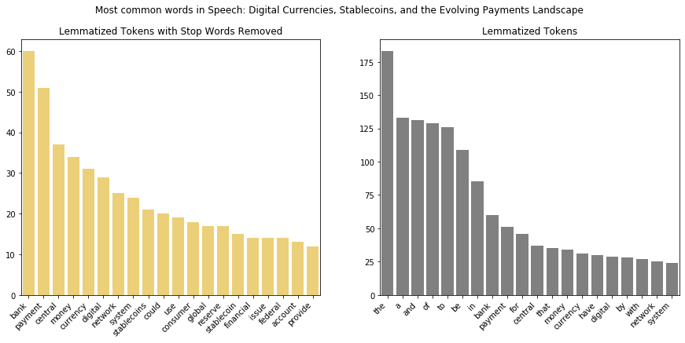

## Result: Topic Modeling
LDA (Latent Dirichlet Allocation) was used to group speeches together based on probabily of a word's frequency in a certain topic vs the frequency in all topics. Doing so 

#### LDA Topic Modeling Example
The 2D visual on the left-hand side maps the topics' similarity to each other, with the bubble size corresponding to the number of speeches categorized into each topic. Number of speeches per topic ranges from approx. 50 (Topic 10) to approx. 250 (Topic 1). The topic highlighted (in red) is Topic 3, and the top 30 most revelant words for Topic 3 are shown on the right.
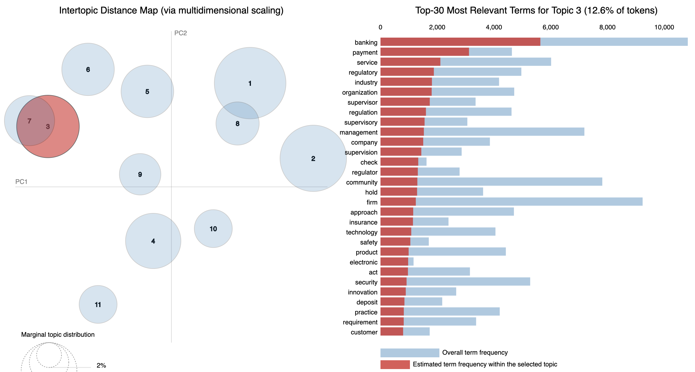

#### Using Domain Knowledge to Name Topics
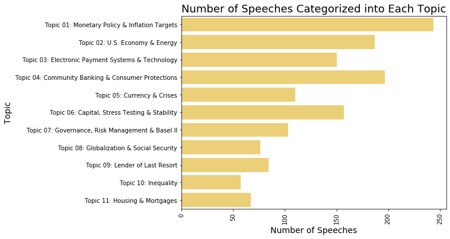

#### Appearance of the Word "Payment" in Topic #3 vs Other Topics
The size of the bubble represents how prevelant the word "Electronic" is for that topic. Notice that "Electronic" appears predominantly in Topic 3. The words "check" and "payment" are also representative of Topic 3 due to the number of times that word appears in Topic 3 (red portion of bar) vs the number of times it appears in the entire corpus (red+blue portion of bar).
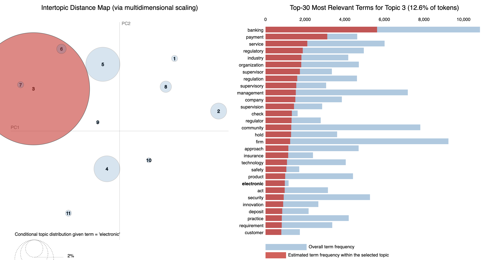

## Result: Doc2Vec and Recommender System
NLP and LDA Topic Modeling in general are difficult to validate beyond spot checks. To corroborate the suggested topic groupings, I used Doc2Vec to visualize speech similarity in 2D space.

Using Doc2Vec to reduce the dimensionality of the speech from a 6,000+ dimensional vector to a 20-dimensional vector, I then used T-SNE to plot each speech in two dimensions.

Doing so not only allowed me to find and recommend speeches that are the cloest to a selected speech — based on the distance between speech vectors — but also see if the topic groupings were clustered visually.

| Speech Name | LDA Topic | Percent Similarity |
| -------- | -------- |:--------:|
| Digital Currencies, Stablecoins, and the Evolving Payments Landscape? | Topic 03: Technology & Payment Systems | 100% |
| Cryptocurrencies, Digital Currencies, and Distributed Ledger Technologies: What Are We Learning? | Topic 03: Technology & Payment Systems | 93% |
| Thoughts on Prudent Innovation in the Payment System | Topic 03: Technology & Payment Systems | 93% |
| Innovation, Technology, and the Payments System | Topic 03: Technology & Payment Systems | 90% |
| Distributed Ledger Technology: Implications for Payments, Clearing, and Settlemen t| Topic 03: Technology & Payment Systems | 87% |
| The Use of Distributed Ledger Technologies in Payment, Clearing, and Settlement | Topic 03: Technology & Payment Systems | 88% |

All speeches in the table above are highlighted (darker orange color & dark gray outline) in the Doc2Vec 2D plot below:
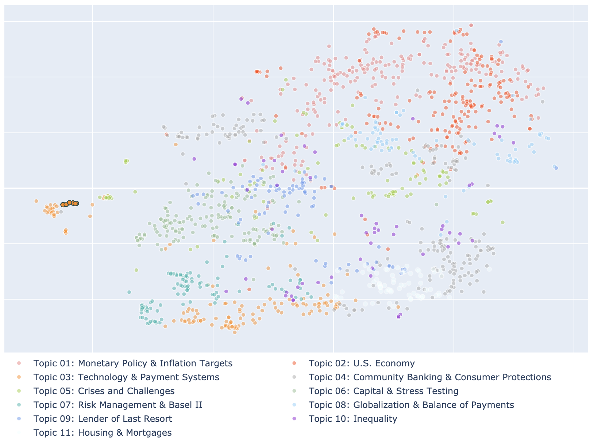

Notice how some topics are tightly clustered (e.g. Topic 7: Risk Management & Basel II, Topic 11: Housing & Mortgages) while other topics seem to be interdispersed (e.g. Topic 10: Inequality). 

## Result: Interactive Front-End for Analysis
*Note: Front-end has not yet been deployed for public use*

Below are some screenshots from the interactive front-end that allows users to investigate trends in topics over time, as well as analysis on particular speeches of interest.

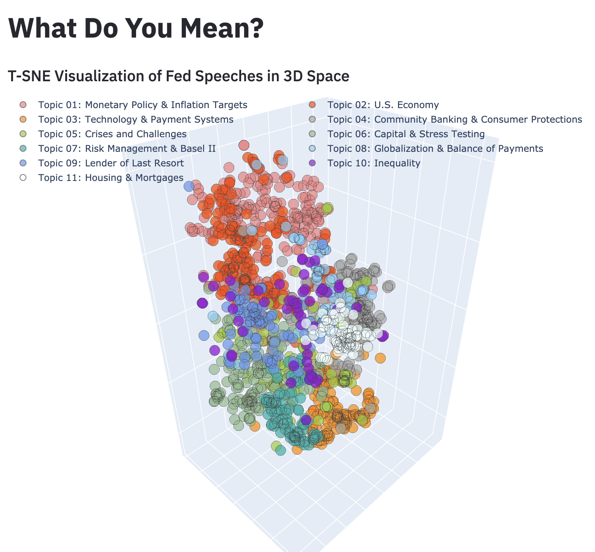
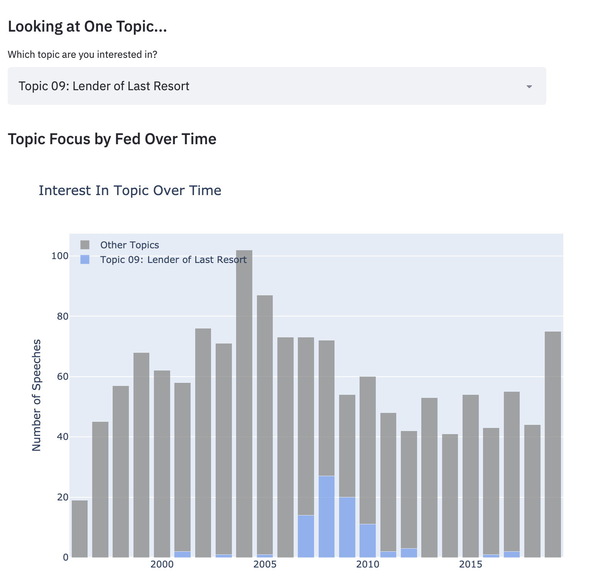
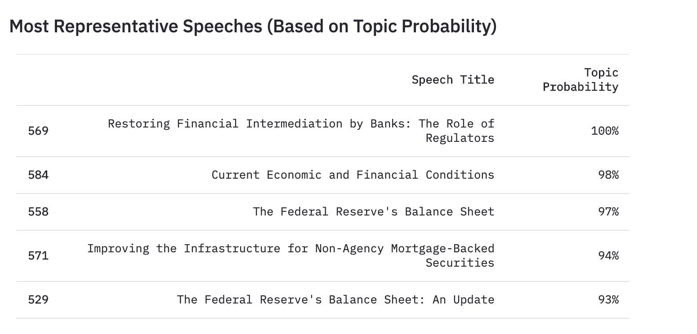
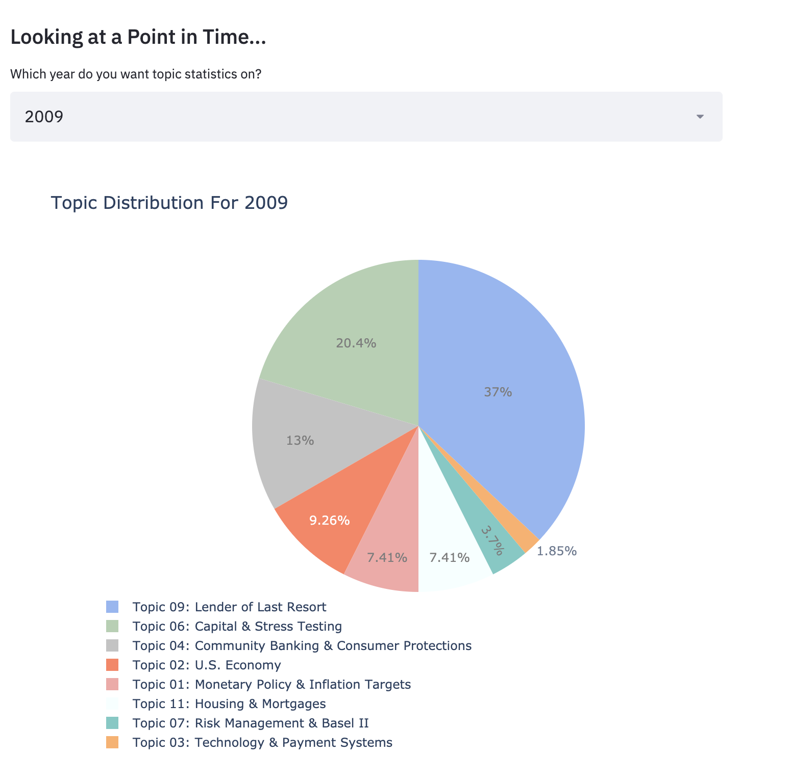
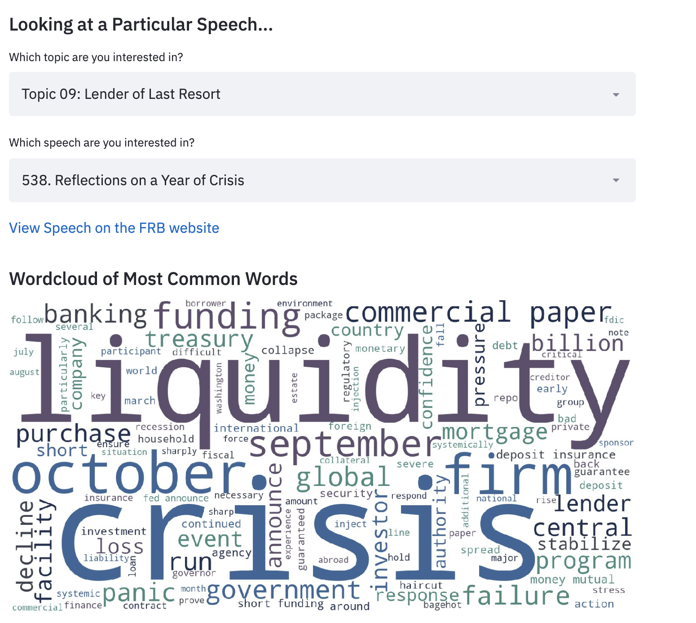

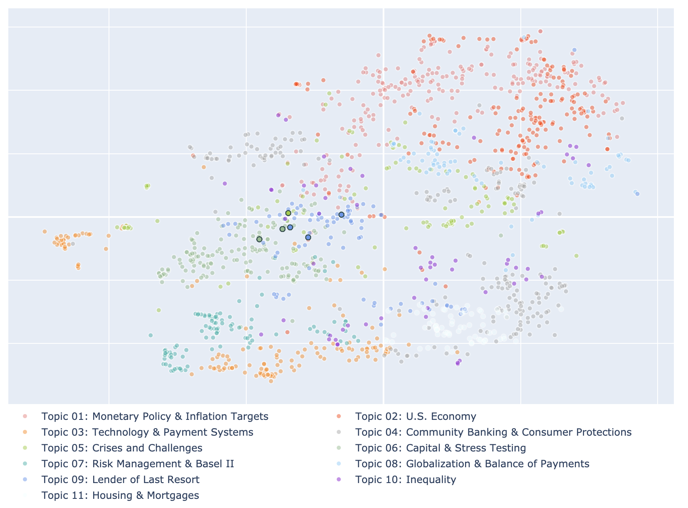

## Next Steps:
Some additional functionality that would be interesting to incorporate
- Further consolidating similar words (supervisory, supervision, supervisor) using either stemming and/or refining part-of-speech (POS) tagging
- Using pre-trained word embeddings like GloVe (Global Vectors for Word Representation) to improve doc2vec model
- Increasing dataset size by including more published communications from the Fed, such as press releases and testimony